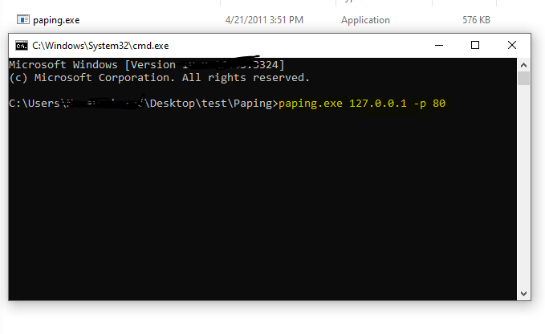
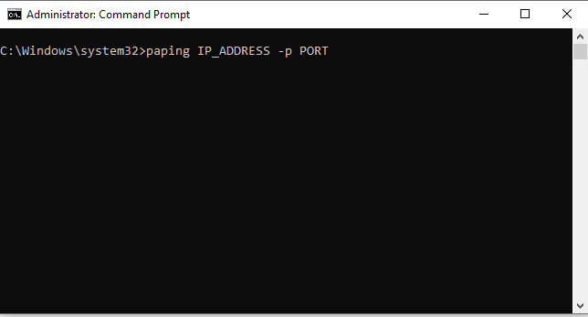
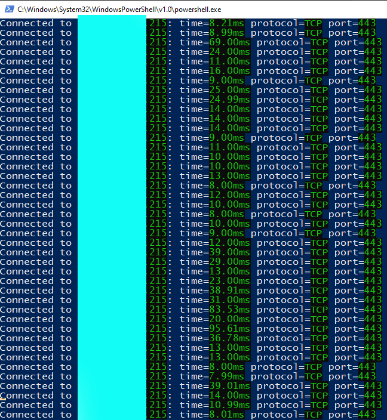

# 😎Paping

"Paping" is a network troubleshooting tool that checks the availability and responsiveness of network hosts using TCP packets. Unlike traditional "ping," paping tests specific ports to diagnose connectivity and service issues. It measures the round-trip time for packets, aiding in identifying online hosts and functional services. This tool is valuable for network administrators and users seeking to diagnose network problems and measure latency.

# NB:- 

You can use it only in Windows.

# Download

  git clone https://github.com/md-rs01/Paping

# Installation

## Go ot Directory and run it using cmd or powershell

### Write cmd & press enter

### Set Your Target server & port

# Usage

### How to write paping command

### Attack in a Server on port 443

## Credits

All Credits goes to `BoyFromBd`

## Contact

Contact in telegram: https://t.me/heartcrafter

